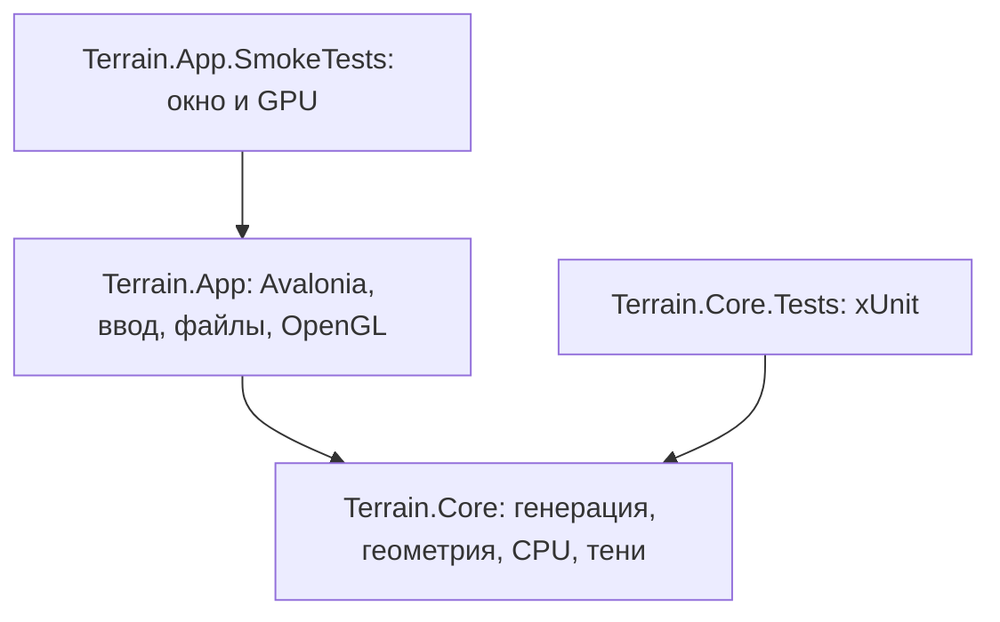

# Устройство решения

Приложение разделено по зависимостям и ответственности. Математика остаётся
читаемой и независимой от интерфейса; переход к новой структуре не меняет формулы.

## Core

`Generation` строит карты; `Models` хранит высоты и треугольную сетку. `Rendering`
преобразует модель и рисует её программно. `Rendering/Shadows` отвечает за
проекцию со стороны света, depth map, PCF и ключ кэша. Один публичный тип находится
в отдельном файле, пространство имён соответствует папке. В Core нет NuGet-зависимостей.

## App

`Program` настраивает платформу; `TerrainApplication` создаёт приложение и окно.
`Views/MainWindow` строит интерфейс на C# и связывает действия пользователя с
сервисами и рендерами. `Controls/OpenGlTerrain` управляет GL-контекстом и проходами
отрисовки. Низкоуровневые привязки вынесены в `Rendering/OpenGl`, работа с файлами
и bitmap — в `Services`.

Интерфейс пока строится непосредственно на C#, без XAML/MVVM. Это осознанная
граница этой реорганизации: она убирает старый проект и смешение ответственности,
а не вводит дополнительные абстракции без изменения продукта. Самостоятельная
математика и два рендера сохраняются.

## Проверки

`Terrain.Core.Tests` — xUnit-проект с тестами по областям: генерация, геометрия,
растеризация и тени. Используется стандартный `dotnet test` и runner для IDE.
`Terrain.App.SmokeTests` — отдельное приложение, которое открывает реальное окно и
проверяет графический контекст. Оно имеет доступ к небольшому internal API окна
через `InternalsVisibleTo`; production-приложение не содержит тестового runner.

Скрипт запуска умеет выбрать обычное приложение или smoke-проект по параметру
`--smoke-test`. Поиск ресурсов производится от корня репозитория, а не старой
папки `CG` или абсолютного пути к компьютеру автора.

## Конфигурация

Общие свойства SDK находятся в `Directory.Build.props`, версии библиотек — в
`Directory.Packages.props`. `global.json` выбирает стабильный SDK .NET 10,
`.editorconfig` задаёт единый формат. `Terrain.slnx` в корне — единственное решение.

Старые WinForms-файлы, DLL и результаты сборки удалены из рабочего дерева.
PDF, изображения и примеры сохранены; для исходных материалов проверяются SHA-256
до и после переноса. Настройки IDE персональны и в репозиторий не включаются.
