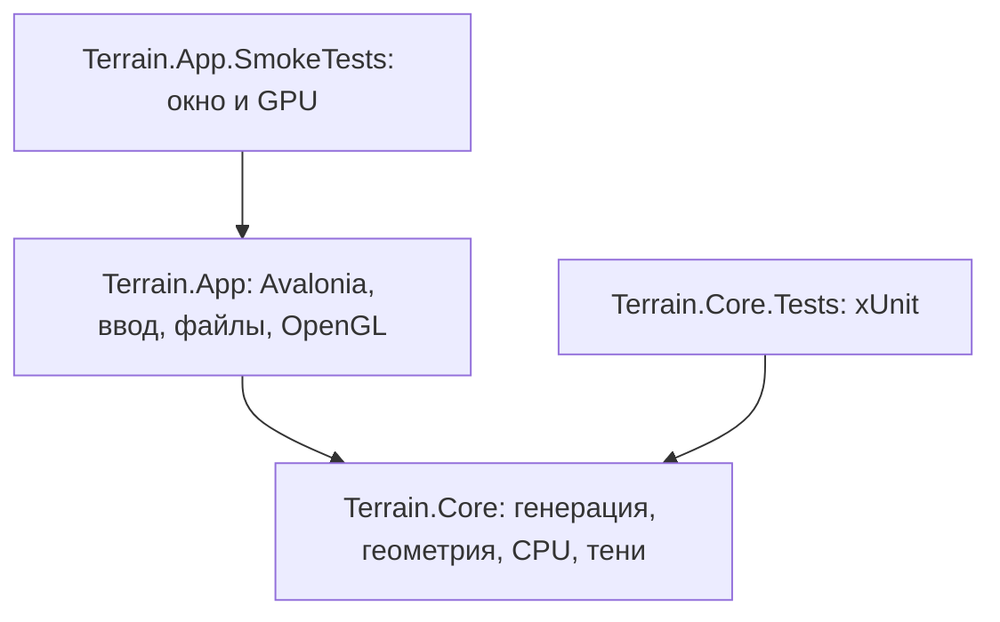

# Устройство решения

Приложение разделено по зависимостям и ответственности. Математика остаётся
читаемой и независимой от интерфейса; переход к новой структуре не меняет формулы.

## Core

`Generation` строит карты; `Models` хранит высоты и треугольную сетку.
`Surface` рассчитывает свойства и цвет материала по высоте, нормали и координатам,
используя отдельную последовательность шума. Цвет вычисляется после нормалей
при построении сетки и одинаково используется обоими рендерами. `Rendering`
преобразует модель и рисует её программно. `Rendering/Shadows` отвечает за
проекцию со стороны света, depth map, PCF и ключ кэша. Один публичный тип находится
в отдельном файле, пространство имён соответствует папке. В Core нет NuGet-зависимостей.

## App

`Program` настраивает платформу; `TerrainApplication` создаёт приложение и окно.
`Views/MainWindow` строит интерфейс на C# и связывает действия пользователя с
сервисами и рендерами. `Controls/OpenGlTerrain` управляет GL-контекстом и проходами
отрисовки. Низкоуровневые привязки вынесены в `Rendering/OpenGl`, работа с файлами
и bitmap — в `Services`.

Интерфейс пока строится непосредственно на C#, без XAML/MVVM. Это осознанная
граница этой реорганизации: она убирает старый проект и смешение ответственности,
а не вводит дополнительные абстракции без изменения продукта. Самостоятельная
математика и два рендера сохраняются.

## Проверки

`Terrain.Core.Tests` — xUnit-проект с тестами по областям: генерация, геометрия,
растеризация и тени. Используется стандартный `dotnet test` и runner для IDE.
`Terrain.App.SmokeTests` — отдельное приложение, которое открывает реальное окно и
проверяет графический контекст. Оно имеет доступ к небольшому internal API окна
через `InternalsVisibleTo`; production-приложение не содержит тестового runner.

Скрипт запуска умеет выбрать обычное приложение или smoke-проект по параметру
`--smoke-test`. Поиск ресурсов производится от корня репозитория, а не старой
папки `CG` или абсолютного пути к компьютеру автора.

## Конфигурация

Общие свойства SDK находятся в `Directory.Build.props`, версии библиотек — в
`Directory.Packages.props`. `global.json` выбирает стабильный SDK .NET 10,
`.editorconfig` задаёт единый формат. `Terrain.slnx` в корне — единственное решение.

Старые WinForms-файлы, DLL и результаты сборки удалены из рабочего дерева.
PDF, изображения и примеры сохранены; для исходных материалов проверяются SHA-256
до и после переноса. Настройки IDE персональны и в репозиторий не включаются.

## Гидрология

`HydrologyBuilder` строит `WaterMap` из исходного `HeightMap`: уровни заполнения,
направления стока, накопление осадков и маски воды/берегов/влажности. Это чистый
расчёт без UI и рендеров. `Mesh.Build` с `HydrologyOptions` использует производные
уровни как видимую поверхность воды и передаёт маски в `TerrainSurface`.
Без опций строится сухой рельеф. CPU и GPU получают одинаковую сетку.
В окне результат обновления воды принимается только для актуального запроса;
повороты камеры, модели и солнца не пересчитывают гидрологию.

## Объекты окружения

`Vegetation/ObjectScatter` размещает `ObjectInstance` по поверхности готовой
сетки с учётом `WaterMap`. `ObjectGeometry` создаёт небольшие процедурные
шаблоны и добавляет их треугольники к сетке. Материалы и нормали проходят общий
путь CPU/OpenGL и теней. Шаблоны создаются один раз; итоговая геометрия объектов
не пересоздаётся при движении камеры или солнца. Изменение настроек окружения
пока перестраивает воду и объекты вместе. Число деревьев и камней хранится в `Mesh`.

## Файлы проектов

`Persistence/SceneDocument` — версионированный снимок исходных высот,
применённых параметров и вида. `SceneFiles` читает и пишет JSON, проверяет
размеры, диапазоны и обязательные поля. Vector3 сохраняет компоненты X/Y/Z;
вычисляемые свойства Scene в файл не включаются. Предел входного файла — 96 МБ.

`MainWindow.Projects` содержит файловые диалоги и синхронизацию элементов
интерфейса. Окно отдельно хранит параметры последней успешно построенной сетки,
поэтому изменения ещё не применённых ползунков не портят сохраняемый проект.
Перед записью файл сериализуется в память; перед заменой сцены загрузка проходит
валидацию и построение геометрии. Во время восстановления обработчики окружения
не запускают конкурирующие пересчёты. Неизвестная версия отклоняется; при изменении
алгоритмов, влияющем на воспроизводимость, потребуется миграция или новая версия.

## Прогулка

`CameraPose` содержит yaw/pitch, `WalkingSurface` вычисляет высоту треугольника,
интерполирует видимую поверхность земли/воды и ограничивает перемещение краями карты.
`MainWindow.Walking` управляет переключением видов и опорной поверхностью;
`MacMouseLook` получает deltaX/deltaY из локального монитора NSEvent (движение
и перетаскивание). CoreGraphics отключает связь движения с позицией курсора
на время захвата; постоянного возврата курсора больше нет. Таймер забирает
накопленные смещения однократно. Esc, потеря фокуса и закрытие окна снимают
монитор и восстанавливают связь курсора. Единственный глобальный нативный блок, его дескриптор и статический C# callback
живут до конца процесса: AppKit может отложить уничтожение наблюдателя после
removeMonitor. На Esc снимается монитор и очищается ссылка на владельца,
но блок не освобождается. Повторные захваты не выделяют новые блоки.
Все вызовы выполняются в UI-потоке.
Гидрология для проходности кешируется, обновляется при изменении окружения,
а не при каждом шаге или движении мыши. После изменения высоты земли камера перепривязывается к поверхности.

В формате 2 хранятся `Scene.Walking`, pitch, сохранённый обзор и прогулочная
камера. Чтение версии 1 использует прежний режим обзора и нулевой pitch.
Математика неба в прогулке вычисляется по мировому лучу каждого пикселя;
в обзоре сохранён стилизованный фон. Ближняя плоскость прогулки 0.005,
обзора 0.05, высота глаз 0.035 в единицах сцены.

Старт выбирается в центре карты независимо от воды и уклона. Постоянный
взгляд мышью не использует Pointer.Capture: отпускание кнопки и потеря захвата
Avalonia больше не сбрасывают режим; его завершают Esc и потеря фокуса окна.

По уточнённому поведению вода и крутизна склонов больше не блокируют прогулку.
Высота берётся из WaterMap.Levels, если вода включена, иначе из исходной карты.
Координаты X/Z ограничиваются точными границами; при движении по диагонали вдоль
края доступная компонента движения сохраняется.

## Данные климата и совместимость проектов

`ClimateBuilder` получает исходную `HeightMap`, `ClimateOptions` и необязательную
`WaterMap`; результат доступен как `Mesh.Climate` и сохраняется при добавлении
геометрии объектов. Материалы читают те же данные, которые использует
размещение объектов в 5.2. CPU, OpenGL и экспорт получают готовые цвета вершин.
Поворот, солнце и высота рельефа не запускают пересчёт климата.

Формат проекта v3 добавляет необязательный `ClimateOptions` с собственным seed.
Значение null означает прежнюю окраску. Версии 1 и 2 открываются с ней же,
без неявного обновления внешнего вида. При сохранении в v3 null сохраняется.
Новые сцены включают биомы по умолчанию. Слайдеры и переключатель биомов
применяются кнопкой обновления окружения (либо при создании/импорте новой карты).
В файл попадает `appliedClimate`, а не ещё не применённые значения слайдеров.

### Лес по биомам (5.2)

`ObjectScatter` интерполирует температуру и доли биомов по тому же треугольнику,
на котором размещается основание объекта. Это связывает материалы и размещение
без повторного расчёта климата. `VegetationOptions.BiomeAware` выбирает новый
алгоритм; отсутствующее поле означает прежний алгоритм. Приложение включает
его для новых карт и при явном обновлении окружения. Без `Mesh.Climate` действует
прежнее размещение. Формат v4 сохраняет флаг; v1–v3 не могут объявлять его true.
Открытие и повторное сохранение старого проекта сохраняют прежний лес.

## Кустарники: первая часть этапа 6

`ShrubOptions` хранит независимые плотность, лимит и seed; `ShrubScatter`
работает после размещения деревьев/камней, читая их положения, но не меняя их.
Общая выборка треугольника в `ObjectScatter.Sample` возвращает также береговую
маску. Кусты используют исходные биомы и те же треугольники, что и материалы.
Два шаблона `ObjectGeometry` расширяют общий набор объектов; `Mesh.ShrubCount`
считает только кусты. При дополнении сетки счётчики существующих объектов
сохраняются. Их точки опоры используют прежний AnchorHeight.

`SceneDocument.Shrubs` добавлен в v5; null означает отсутствие кустарников.
Приложение сохраняет appliedShrubs, восстанавливая также пользовательский seed
и лимит из файла. Новая генерация/импорт задаёт seed от seed карты (0 для импорта),
внутри scatter используются независимые XOR-потоки. Старые файлы v1–v4
сохраняют прежний вид. Слайдер не перестраивает сцену на каждом движении.

## Итоговая архитектура этапов 6–10

Этот раздел уточняет описанную выше историческую реализацию. Текущий порядок:
исходная HeightMap → необязательная ThermalErosion → один HydrologyBuilder →
WaterGeometry.Prepare (рабочие русла) → климат/материалы → отдельная водная сетка
и объекты. Mesh хранит WorkingMap и Water; исходная карта остаётся в документе.
Основания объектов выбираются по окончательным треугольникам суши. WalkingSurface
использует ту же рабочую землю и водную маску; границы карты остаются единственным
препятствием для прогулки. Климат зависит от высот после эрозии, до углубления русел.

DetailOptions/RockScatter добавляют собственный поток случайности для осыпей;
TerrainSurface меняет снежный покров по плавному пространственному шуму.
Atmosphere задаёт общую формулу дымки; CPU и GLSL применяют её после освещения.
Дымка, камера и солнце не запускают генерацию биомов, воды или объектов.

OpenGL больше не получает спроецированную на CPU сетку для каждого кадра.
Собственные преобразования модели готовят мировые позиции/нормали; буфер
переиспользуется, vertex shader выполняет перспективу по базису камеры,
отсечение выполняет GPU. Ключ буфера включает сетку, масштаб высоты, вращение,
режим прогулки и проекцию теней. Камера передаётся через uniforms.
CPU сохраняет собственную проекцию/отсечение и кеширует один результат.
Расчёты по-прежнему принадлежат проекту; Avalonia предоставляет окно и контекст.

Версия проекта 6 добавляет Details, 7 — FogDensity, 8 — SeparateSurface и
ChannelDepth, 9 — Erosion. Отсутствующие поля отключают соответствующее новшество,
старые версии не могут объявлять новые несовместимые параметры. Сохраняются
применённые настройки, а не ещё не применённые значения слайдеров.
Эрозия хранится отдельно от исходных высот: её отключение полностью обратимо.

Утилита tools/Terrain.Gallery включена в решение IDE. Она восстанавливает
сцену из исходного проекта, сохраняет этап, проверяет повторное построение
и создаёт PNG собственным CPU-рендером.

## Третий режим: автоматический мир

WorldTerrain и WorldStream в Terrain.Core/World отвечают за непрерывные мировые
поля, пять регионов, геометрию участков, ограниченный кеш и безопасную область
камеры. MainWindow.World управляет загрузкой, отменой, публикацией сетки и
возвратом редактора. Самостоятельный DayNight и парный WorldSkyShader добавляют
автоматическое небо в оба рендера. Подробности и ограничения: [world.md](world.md).
